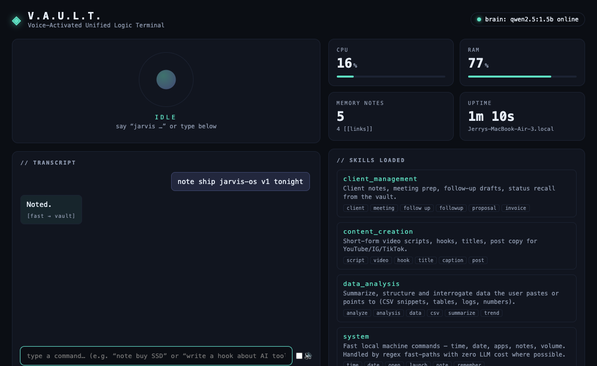

# ◈ jarvis-os

**A 100% free, 100% local AI personal operating system.**
Voice in, voice out, long-term memory, skill architecture, one HUD — and not a single API key.

Built on the 5-layer architecture: **Brain** (skills) · **Memory** (Obsidian vault) · **Voice** (local STT/TTS) · **Face** (V.A.U.L.T. HUD) · **Handoff** (clone → run → reskin).

| Layer | What runs it | Cost |
|---|---|---|
| 🧠 Brain / LLM | [Ollama](https://ollama.com) + `qwen2.5:1.5b` (swappable in `config.json`) | free, local |
| 📚 Memory | Plain-markdown vault, Obsidian-compatible, auto `[[backlinks]]` | free, local |
| 👂 Hearing (STT) | `faster-whisper` (tiny model, auto-downloads once) | free, local |
| 🗣 Speech (TTS) | macOS `say` built-in — or optional [Kokoro](https://github.com/thewh1teagle/kokoro-onnx) neural voice | free, local |
| 🖥 Face | FastAPI + WebSocket + vanilla-JS dark HUD | free, local |

No cloud. No accounts. Your voice never leaves the machine.



## Quick start (3 commands)

```bash
git clone <this-repo> && cd jarvis-os
./setup.sh          # venv + deps; tells you if the free brain needs `brew install ollama`
./run.sh            # → http://127.0.0.1:8765
```

Say **"jarvis, what time is it"** — or type into the HUD's command box (works even with no mic).

> First mic use: macOS asks for Microphone permission for your terminal. First voice command downloads the free whisper `tiny` model (~75 MB) once.

## How a command flows

```
 🎙 mic ──► energy VAD ──► faster-whisper ──► "jarvis, …" wake check
                                                   │
                       ┌───────────────────────────┼──────────────────────────┐
                       ▼                           ▼                          ▼
                 regex fast-path             SKILL.md dispatch           general chat
              (time/open/note —           (only the matched skill     (local LLM + vault
               zero LLM cost)              enters the context)          search context)
                       └───────────────────────────┼──────────────────────────┘
                                                   ▼
                                    reply ──► TTS speaks ──► HUD updates
                                       └──► vault/ (session log + reports, [[linked]])

LLM lanes stream: the reply is spoken **sentence by sentence while it's still
generating** — first words in ~2 s. English speaks through Kokoro's neural voice
when installed (`./setup.sh --with-kokoro`); CJK text and clean installs use `say`.
```

## The five layers, hands-on

**1 · Skills (`skills/*/SKILL.md`)** — one folder per capability with frontmatter
(`name`, `description`, `triggers`) and a body defining Role / Inputs / Outputs / Tools.
Only a *matched* skill's body is injected into the LLM context — nothing else is loaded.
Add a skill = add a folder. Restart. Done.

**2 · Memory (`vault/`)** — open this folder as an Obsidian Vault and you get the
knowledge graph for free. The assistant writes session logs (`20_Sessions/`), long
outputs (`10_Reports/`) and quick notes (`00_Inbox/`) with `[[backlinks]]`; retrieval
feeds vault search back into answers.

**3 · Voice** — `server/voice/`: energy-VAD listener → wake word → whisper STT →
router → TTS. Wake word, VAD threshold, whisper model size: all in `config.json`.
Want the neural voice? `./setup.sh --with-kokoro` then set `"tts_engine": "kokoro"`.

**4 · Face** — the V.A.U.L.T. HUD at `http://127.0.0.1:8765`: status orb
(idle/listening/thinking/speaking), live transcript feed, command box, CPU/RAM/memory
tiles, loaded skills, and `vault/Schedule.md` as your day plan.

**5 · Handoff / reskin** — everything client-facing lives in `config.json`:
assistant name, wake word, brand text, logo glyph, all colors, LLM model. Fork the
repo, edit one JSON file, and it's a different product. `.env` is optional and
never required.

## Optional: Hermes hands (real-world reach)

If the machine has a [Hermes](https://github.com/NousResearch) agent stack installed
(`~/.hermes/bin`), jarvis-os auto-detects it and gains voice-driven reach:

```
"jarvis, check my email"                → Gmail inbox, latest 5
"jarvis, search the web for MCP spec"   → live web search, digested by the local brain
"jarvis, what's on my calendar"         → next events
"jarvis, send email to a@b.com about…"  → drafts it, then WAITS for "confirm"
```

Side-effect commands are **always confirmation-gated** — nothing sends until you say
*confirm*. No Hermes installed? The adapter stays dormant and the OS is unchanged;
credentials always live inside Hermes, never in this repo.

## Swap the brain

Any Ollama model works — edit `config.json → llm.model`:

```bash
ollama pull llama3.2:3b        # stronger general chat
ollama pull qwen2.5:7b         # stronger 中文, needs ~8 GB RAM
```

Prefer a hosted model later? Implement the two-method interface in `server/llm.py`
(`available()`, `chat()`) — the rest of the OS doesn't change.

## License

MIT — fork it, reskin it, ship it.
